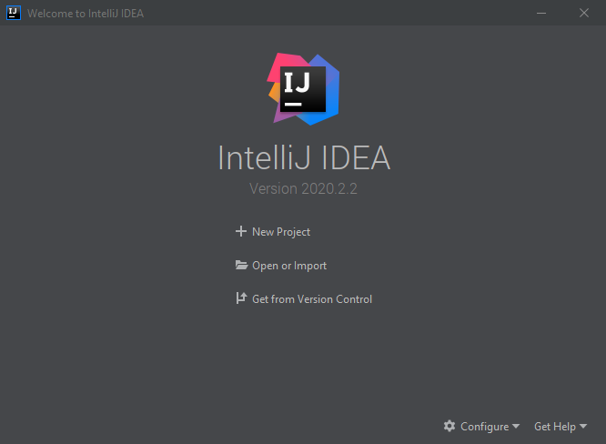
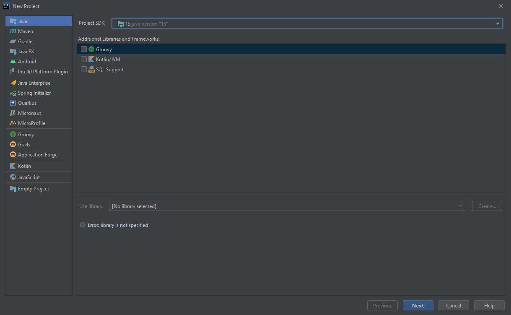
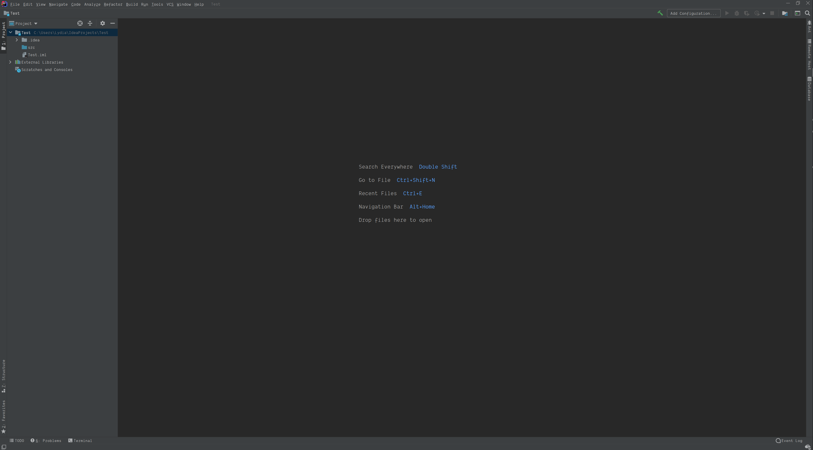
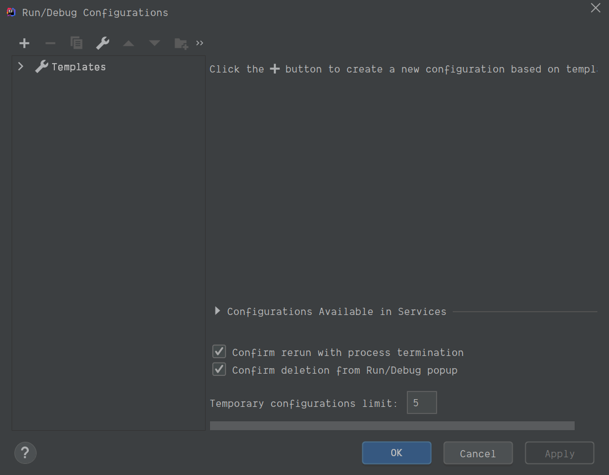
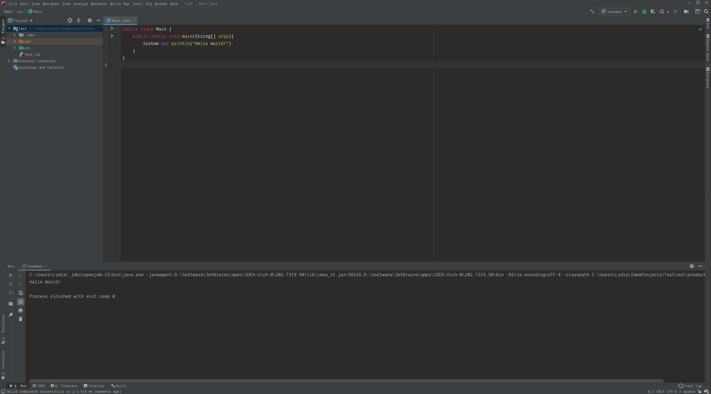

# TCDS First Year Survival Guide

## Introduction
Congratulations on making it into Computer Science at Trinity! Here is a list of things I wish I knew when I started out as a naïve and uninformed fresher.

If you have any questions feel free to file an issue here on GitHub or you can reach me on discord through DMs @Lydia#3999 or the [//TCDCS Discord Server](https://discord.gg/Rtxd7eH)

## Student Deals and Licenses
You may or may not be aware that being a college student more often than not entitles you to a student discount to a variety of things, from software subscriptions, to Spotify premium, to food in restaurants. It might seem awkward at first, but if you wish to save a fairly significant amount of money, you should ***absolutely*** make use of this discount at every chance you get. Remember *there is no harm in trying*. Whenever you order at a restaurant ask "Do you have a student discount?", if you ever see a piece of software online send them an email asking "Do you have a student discount?". The phrase "Do you have a student discount?" should be the first thing you say to anyone for the rest of your time in college.

But what's better than a discount? Getting something for the low, low price of **FREE**. By having an email address registered with the college you are entitled to a number of pieces of software and digital services for free.

### GitHub Pro
Whilst its use may not be immediately apparent at the start of Computer Science, over the course of the coming years you will find that GitHub is perhaps one of the most useful tools to a programmer allowing you to store, log and collaborate on both your college and personal projects.

Having a Pro membership on GitHub grants you a few neat features, but perhaps the most useful is the ability to create private repositories (projects). This is especially important if you want to avoid getting hit by the colleges plagiarism detection as having exam related material in a public repo is against the rules.

It is also worth noting that the GitHub Pro membership is tied to your college email, and seeing as the college will never delete your student email, you effectively have free GitHub Pro for life.

[Claim your GitHub Pro membership here.](https://education.github.com/pack)

### Office 365
This one is pretty self explanatory! All the classics, Word, Excel, PowerPoint, etc. All for FREE! All you have to do is download the installer from the website and sign in with your college email!

[Download Office 365 here.](https://www.office.com)

### Microsoft Azure
Being an SCSS student entitles you do a number of developer centric software straight from Microsoft, including Windows 10 Pro and Visual Studio. Simply sign into the Azure portal to claim your keys and downloads!

[Access the Azure Portal here.](https://azure.microsoft.com/en-us/)

### Jetbrains Suite
Perhaps the most useful of all the software listed here! Jetbrains offer an entire suite of IDEs for nearly any language you could imagine, all with amazing syntax highlighting/code formatting/debugging tools/etc. And what's best of all it includes fantastic support for a variety of Version Control Systems, which will remove a significant portion of headaches for the Programming Project.

[Claim your Student License for the Jetbrains Suite here.](https://www.jetbrains.com/community/education/#students)

## The Eighth Ring of Hell Runs on Java
Java kinda sucks a lot, but it serves as a pretty decent introduction to programming, and regardless of whether or not you like it you will be stuck with it for the next few years of college :)

Throughout this course you are free to use what ever IDE you wish, Eclipse is normally the most popular one amongst students, but personally I think it sucks. So for the purposes of this document I will be running through how to configure IntelliJ to start programming in Java.

### 00 Prerequisites
Before beginning make sure you have the following installed:
- [The Java SDK (This can be downloaded from within the 'New Project' menu in IntelliJ)](https://www.oracle.com/java/technologies/javase-jdk15-downloads.html)
- [The latest version of processing.](https://processing.org/download/)

### 01 Creating a Project
Upon opening IntelliJ for the first time you will be greeted by this screen.



Press 'New Project to continue.'

We now have to input our JDK settings which should look like they do below. You can select your version of the JDK using the dropdown labeled 'Project SDK', here you can also have IntelliJ download the JDK for you.



The next screen is the template selector, for now you can ignore this and press 'Next'.

Now you will be asked to input a name for your project, once chosen press 'Finish'.

You have now successfully created an IntelliJ project!



### 02 Creating a Java Class
In the editor, right click the `src` folder and choose `New > Java Class` and name it `Main`. The main pane of IntelliJ should now have a text editor in it and the barebones of a java class.

Paste the following code into the text editor:

```Java
public class Main {
    public static void main(String[] args){
        System.out.println("Hello World!");
    }
}
```

### Running Your Code
Before we can run our simple program we first have to configure IntelliJ to know what version of Java to use.

There should be a dropdown in the top write of IntelliJ that says 'Add Configuration...', click this and the following window will open.



Here, click the + button in the top left and choose 'Application' from the dropdown. Now press the '...' button next to the text field labeled 'Main class:'. Choose the 'Main.java' class that we created earlier.

Press okay and we should now see new buttons in the top right of IntelliJ. Press the Run button (Green Play Button).

### Hello World!



If all went well you should see the iconic phrase 'Hello World!' in the newly opened console. You have just successfully run a Java program!

## Java: The Sequel (Processing)
**Remember, Processing is just a Java library!**

Whilst the Processing IDE may make it seem as if Processing is its own language, it is merely a Java library. That means that you can use the features of processing in any IDE that supports Java, however this requires some additional setup.

I will be detailing the steps required to programming in Processing using IntelliJ (which is free for students as detailed above).

### 00 Prerequisites
Before beginning make sure you have the following installed:
- [The Java SDK (This can be downloaded from within the 'New Project' menu in IntelliJ)](https://www.oracle.com/java/technologies/javase-jdk15-downloads.html)
- [The latest version of processing.](https://processing.org/download/)
- [IntelliJ IDEA Ultimate](https://www.jetbrains.com/idea/)

Additionally follow the steps from **The Eighth Ring of Hell Runs on Java** to setup a basic Java Project.

## 'Team' Project and Subversion

## Verilog and the Cult of Waldron
Beginning Digital Logic Design you may be told about a piece of software called Icarus Verilog. Don't bother with it. It's a complete pain to download, install and use and you can complete the majority of the module with nothing more than [Atom](https://atom.io/) and the [Verilog syntax highlighting plugin](https://atom.io/packages/language-verilog).

In the second semester you will be asked to start writing Verilog test-benches in addition to Verilog programs. For this I recommend the website [EDA Playground](https://www.edaplayground.com/) which will allow you to write and run a test-bench in browser.

## ARM ASM [ASMR]
To my knowledge, the software used for the Introduction to Computing modules has changed from the awful Kiel MicroVision to Visual Studio. So unfortunately I do not have much advice on the software side of things. However the biggest piece of advice I can give is that you should *always* write pseudo-code before starting to write in ASM, it will make your life so much easier throughout this module.

## We Live in a Society
For many, Computers and Society may be initially off-putting, however if you approach the module with an open mind you will begin to find the module to be enjoyable and interesting.

### The Lectures
The lectures are best when the class participates in them. Don't be scared to chime in when prompted, however *be prepared to be put on the spot. The lecturer will ask you hard questions about ideas you put forward in front of the whole class!*

### The Presentation
The grading of the module revolves around a final presentation at the end of the semester. I highly recommend taking the topic and choosing something you are personally interested in/passionate about in relevance to your topic. A presentation is always better when the audience can tell that the speaker is interested in the topic of their presentation. Additionally, keep a clean, consistent, and appealing visual styling for your presentation.

*Avoid put memes or jokes throughout your presentation, they will not land very well with the judges.*

## R and RStudio

## Don't Trust WYSIWYG
We've all tried to add an image to a Word document only to have it move everything around and still end up in the wrong place.

Over the course of your course you will have to submit a number of essays and write-ups. My recommendation is to never use 'What You See Is What You Get' software like Microsoft Word for these assignments as they will only lead to headaches and slow you down in the long run. Instead I recommend using a markup language, particularly LaTeX. This may seem incredibly daunting to learn at first, but after your first go you will realise that its syntax is incredibly simple, but extremely flexible. Not only will it allow you to make your documents look more professional, but it will save you a lot of time in the long run.

I personally would recommend using Overleaf, which is a free online LaTeX interpreter with a live preview of your document.

- [Check out Overleaf here](https://www.overleaf.com)
- [The basics of LaTeX syntax](https://en.wikibooks.org/wiki/LaTeX/Basics)

For taking your own notes, I recommend using Markdown as it is even easier to use than LaTeX, and allows for quick formatting of text documents. In fact this document was written entirely using Markdown. For writing markdown I personally use the Atom text editor, which is highly customisable and easy to use, alongside being free and open source.

- [Atom](https://atom.io/)
- [The basics of Markdown](https://www.markdownguide.org/basic-syntax)

## Societies, the Student Union and You

## Where to Sit and/or Eat on Campus

## Outroduction
